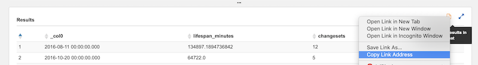

# Workshop Description

_This workshop was designed to be run in-person on a shared EC2 instance with JupyterHub at the [2019 HOT Summit](https://summit2019.hotosm.org/). I have updated the description so that it can run locally, but there may still be configuration details that are confusing. If you'd like to talk more about this, or run a similar workshop, let me know:_
`jennings . anderson @ colorado.edu`

There are two steps to this OSM data analysis workshop:

1. First, we use [Amazon Athena](aws.amazon.com/athena) to query pre-processed OSM historical data.
	- OSM historical editing data is currently available for the following areas. Database table names shown here:
 	
	- All OSM `changesets` metadata is available
	- The pre-processed data exists as individual OSM objects with WKT geometries _(not nodes/ways/relations)_
	- The results of these queries are automatically saved to an Amazon S3 bucket.
2. Second, we use [Jupyter Notebooks](http://workshop.yetilabs.science) for an interactive analysis environment to download the query results from S3 and analyze/visualize.

## Getting Started

### Part 1: Amazon Athena

<!-- 

1. For this workshop we'll be sharing an AWS account. You can login here: 
  
  [https://hot-aws-workshop.signin.aws.amazon.com/console](https://hot-aws-workshop.signin.aws.amazon.com/console) 
  
  Use the following credentials where `[NUMBER]` is any number between 1 and 90: `workshop-1`, `workshop-2`, `workshop-3`, etc.

		username: workshop-[number]
		password: < see presentation slides> 

1. Go to the Amazon Athena console: [https://us-east-2.console.aws.amazon.com/athena/home?region=us-east-2#query](https://us-east-2.console.aws.amazon.com/athena/home?region=us-east-2#query). 

	Once logged in, double check that the region is set to `us-east-2` (Ohio) because that is where the pre-processed OSM data lives. _Not required, but if you'd like to change the workgroup, you can choose any of the other workshop groups by clicking on the Workgroup tab. This way you can save queries into a workgroup unique to you._

	

	**Confirm that you are using the `osm` database. If there are no tables, see the [Athena Setup](https://github.com/jenningsanderson/aws-hot-workshop/blob/master/setup.md#athena-setup) instructions to load the tables.**		
	
-->

Using your [Amazon Web Services](https://aws.amazon.com/) account, log into [Amazon Athena](https://aws.amazon.com/athena).

1. Once logged in, double check that the region is set to `us-east-2` (Ohio) because that is where the pre-processed OSM data lives.

	**You'll need to set up an `osm` database. Use the queries found in the [Athena Setup](https://github.com/jenningsanderson/aws-hot-workshop/blob/master/setup.md#athena-setup) description to load the tables.**
	
		
	_Check the workgroup and direct output to an S3 bucket of your choosing, one with public read-access in us-east-2 so that you can easily retrieve or share the query results. Buckets outside this region will incur higher inter-region transfer costs._

2. Now you can begin querying the OSM data, see the [Data section](#Data) below for a more detailed description of what is attributes are available. Here are few queries to get you started and familiar with the interface.

	_Copy the exact queries here and paste them into the query window_.

	1. Count the number of users to ever work on a HOT task:

		```sql
		SELECT count(DISTINCT(uid))
		FROM changesets
		WHERE lower(changesets.tags['comment']) LIKE '%hotosm%'
		```
		It should return ~ 140,930. That's a lot of people. What about just this year?

		```sql
		SELECT count(distinct(uid))
		FROM changesets
		WHERE lower(changesets.tags['comment']) LIKE '%hotosm%'
			AND changesets.created_at > date '2019-01-01'
		```
		This should return ~ 25,988. Wow, 25k mappers working on at least 1 hot task in 2019. What about users who have more than 1 HOT-related changeset?

		```sql
		SELECT count(uid) FROM (
		  SELECT uid, count(id) AS num_changesets
		  FROM changesets
		  WHERE lower(changesets.tags['comment']) LIKE '%hotosm%'
		  GROUP BY uid
		) WHERE num_changesets > 1
		```

		~ 121,860, implying only 20k users only made 1 changeset.

		These are simple results in which Athena is only returning single values. Let's dig into the data a bit more...


	2. Find all HOT-related changesets, grouped by user with basic per-user statistics.

	   ```sql
		SELECT
		    changesets.user,
		    min(created_at) AS first_edit,
		    max(created_at) AS last_edit,
		    date_diff('day', min(created_at), max(created_at)) AS lifespan,
		    sum(num_changes) AS total_edits
		FROM
		    changesets
		WHERE
		    lower(changesets.tags['comment']) LIKE '%hotosm%' -- hotosm changesets only
		GROUP BY
		    changesets.user
		ORDER BY lifespan DESC
		```

		The results from this query will be a CSV with ~ 140k rows, one per mapper:

		

		At the upper-right, there is a link to download the results as a CSV file. To explore these results in more depth, we will load these CSV files into a **Jupyter Notebook**, as described next. This is done by copying and pasting _this_ link. You can do this with a `right-click`:

		

### Part 2: Logging into the Jupyter Notebooks

After cloning this repository, run `jupyter notebook` from this directory (or browse to it if running Jupyter elsewhere). If you don't yet have jupyter installed, [click here](https://jupyter.readthedocs.io/en/latest/install.html).

_For best performance, consider running this notebook server on an Amazon EC2 instance in the us-east-2 region._

<!--

1. There is an instance of JupyterHub running on an Amazon EC2 machine located at [workshop.yetilabs.science:8000](http://workshop.yetilabs.science:8000) that will allow each workshop participant to run their own analysis environment.

	Similar to Athena, you can log in with the following credentials: 

		username: workshop-[number]
		
	where `[NUMBER]` is any number between 1 and 90, examples: `workshop-1`, `workshop-2`, `workshop-57`, etc. 
	
	Whatever **password** you enter when you first login will be the new password for this account. I suggest either leaving this blank or using  `hotsummit2019`.
	
	
	
-->
4. When notebook server is running, you should see a page that looks like this:

	

_Edit the `workshop_utils.py` file to point to the S3 bucket where your queries are stored, as specified in the workspace above. Without this, Jupyter cannot find your query results._


5. Click on the `0. Start Here - All Hot Mappers Tutorial.ipynb`, when it starts, you should see this:

	

	Follow the directions in the notebook to load the CSV file from the previous query into the notebook and create a few charts.


### Part 3: Other Notebooks
There are 10 numbered notebooks, (numbered for organization, not difficulty). They contain sample queries and the necessary code to analyze the results. Try them out and plug in your own spatial bounds to look at different areas.

#### Athena to Jupyter
_Remember, when you run a new query in Athena, you need to copy the URL of the CSV file and paste that URL into the notebook to get the results from Athena to Jupyter_

First, copy the URL from Athena:


Then paste it (with quotes) into the notebook, storing it as a variable like `query`:

```python
query = "https://us-east-2.console.aws.amazon.com/athena/query/results/6cab4ea3-8431-4cd6-8f89-8881fa43c8b2/csv"
```
Then run run the `load_dataframe_from_s3` function to get the query results into a Pandas Dataframe.

```python
df = load_dataframe_from_s3(query)
```


#### Resources

1. For spatially bounded queries, [this bounding box tool](https://boundingbox.klokantech.com/) can quickly construct WKT bounding boxes. I recommend having this tool open in another tab for quick reference.


<hr>
<br>

## Data

Our dataset has gone through one step of pre-processing. Using the [OSMesa utility](https://github.com/azavea/osmesa), the raw node/way/relation elements have been converted into single OSM objects with WKT geometries. This conversion also accounts for _minor versions_, the unaccounted versions of ways and relations created by modifying the child object (like squaring a building or fixing a road).

Therefore the data looks slightly different from the original OSM data model, namely the following fields:

|Attribute (Column) | Description|
|-----|-----|
| `updated` | When this version/minor version of the object was created |
| `valid_until` | When this particular version was altered, making this version of the object no longer the most recent |
| `minor_version` | How many times the geometry / child elements of the primary element has been modified |
| `version` | The version of this object that corresponds to the version of the OSM element ||
| `geom` | The geometry of this version of the object (WKT) |

<hr>

## Acknowledgements
This workshop is made possible by pre-processing the full-history editing record of OSM with [OSM2ORC](https://github.com/mojodna/osm2orc) and [OSMesa](https://github.com/azavea/osmesa), and the help of Seth Fitzsimmons.

Jennings Anderson is a Postdoctoral Researcher at the University of Colorado Boulder. The preparation and design of this workshop is thereby supported by CU Boulder and the US National Science Foundation Grant IIS-1524806.

Amazon Web Services is providing computational resources, financial support, and planning / organizing the production of this workshop.
