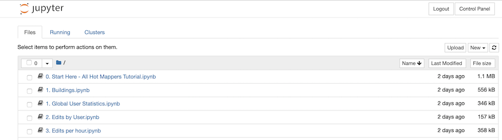

# Workshop Description

There are two steps to this OSM data analysis workshop: 

1. Query OSM data using [Amazon Athena](aws.amazon.com/athena)
2. Loading the results into a [Jupyter Notebook](http://workshop.yetilabs.science) for interactive data analysis.

## Getting Started

#### Part 1: Amazon Athena

1. Visit [aws.amazon.com/athena](https://us-east-2.console.aws.amazon.com/athena/home?force&region=us-east-2#query). You'll need to log in with the following credentials: 

		TODO
	
	Double check that the region is set to `us-east-2` (Ohio) because that is where the pre-processed OSM data lives.

2. Now you can begin querying the OSM data, see the [Data section](#Data) below for a more detailed description of what is attributes are available. 

	1. For spatially bounded queries, [this bounding box tool](https://boundingbox.klokantech.com/) can quickly construct WKT bounding boxes
	2. Here's an example query to count the number of users to ever work on a HOT task:

		```sql 
		SELECT count(DISTINCT(uid))
		FROM changesets
		WHERE lower(changesets.tags['comment']) LIKE '%hotosm%'
		```
		It should return ~ 140,930. That's a lot of people. How many of them have made more than 1 changeset?
		
		```sql
		SELECT count(uid) FROM (
		  SELECT uid, count(id) AS num_changesets
		  FROM changesets
		  WHERE lower(changesets.tags['comment']) LIKE '%hotosm%'
		  GROUP BY uid
		) WHERE num_changesets > 1
		```
		
		~ 121,860, implying about 20k users only made 1 changeset. What about just this year?

		```sql
		SELECT count(distinct(uid))
		FROM changesets
		WHERE lower(changesets.tags['comment']) LIKE '%hotosm%'
			AND changesets.created_at > date '2019-01-01'
       ```
       ~ 25,988. Okay, so over 26k mappers have submitted a `hotosm` related changeset comment so far in 2019.
       
	3. Now let's explore all of those users... 
	   
	   ```sql
		SELECT
			changesets.user, min(created_at) AS first_edit, 
			max(created_at) AS last_edit, 
			sum(num_changes) AS total_edits
		FROM 
			changesets
		WHERE
			changesets.tags['comment'] LIKE '%hotosm%' -- hotosm changesets only
		GROUP BY 
			changesets.user 
		```
		
		To dive into these results, we'll move over to the Jupyter Notebooks: 

#### Part 2: Logging into Jupyter Notebook

1. There is an instance of JupyterHub running on an Amazon EC2 machine located at [workshop.yetilabs.science:8000](http://workshop.yetilabs.science:8000) that will allow each workshop participant to run their own analysis environment.
2. **Tell the workshop organizers what username you would like to use**.
3. Your username will be created and set with whichever password you enter the first time you log in (the password can be empty). _However, Until the workshop organizer creates the corresponding local account, the notebook server will fail to Spawn_.

4. When you are successfully logged in and the notebook server is running, you should see this in your browser: 

	 

5. Click on a notebook to launch.


### Data

Our dataset has gone through one step of pre-processing. Using the [OSMesa utility](https://github.com/azavea/osmesa), the raw node/way/relation elements have been converted into single OSM objects with WKT geometries. This conversion also accounts for _minor versions_, the unaccounted versions of ways and relations created by modifying the child object (like squaring a building or fixing a road).

Therefore the data looks slightly different from the original OSM data model, namely the following fields: 

|Attribute (Column) | Description|
|-----|-----|
| `updated` | When this version/minor version of the object was created |
| `valid_until` | When this particular vernor version was altered, making this version of the object no longer the most recent |
| `minor_version` | How many times the geometry / child elements of the primary element has been modified | 
| `version` | The version of this object that corresponds to the version of the OSM element ||
| `geom` | The geometry of this version of the object (WKT) |


### Setup

_Hopefully this can be run ahead of time and workshop participants can log into a specific account/workspace that has all of this already configured?_


#### Creating the relevant tables
First, ensure that the region is set to us-east-2 (Ohio), then run the following Athena queries: 

##### 1. Nepal
```
CREATE EXTERNAL TABLE `nepal`(
  `type` tinyint, 
  `id` bigint, 
  `geom` string, 
  `tags` map<string,string>, 
  `changeset` bigint, 
  `updated` timestamp, 
  `valid_until` timestamp, 
  `visible` boolean, 
  `version` int, 
  `minor_version` int, 
  `bbox` struct<minx:float,miny:float,maxx:float,maxy:float>)
ROW FORMAT SERDE 
  'org.apache.hadoop.hive.ql.io.orc.OrcSerde' 
STORED AS INPUTFORMAT 
  'org.apache.hadoop.hive.ql.io.orc.OrcInputFormat' 
OUTPUTFORMAT 
  'org.apache.hadoop.hive.ql.io.orc.OrcOutputFormat'
LOCATION
  's3://osm-30k/orc/nepal_wkt'
TBLPROPERTIES (
  'numFiles'='5', 
  'numRows'='8113647', 
  'presto_query_id'='20190821_230045_00023_ehmbb', 
  'presto_version'='0.220', 
  'rawDataSize'='4351815521', 
  'totalSize'='1318338251')
```

##### 2. Central America / Caribbean
```
CREATE EXTERNAL TABLE `central_america`(
  `type` tinyint, 
  `id` bigint, 
  `geom` string, 
  `tags` map<string,string>, 
  `changeset` bigint, 
  `updated` timestamp, 
  `valid_until` timestamp, 
  `visible` boolean, 
  `version` int, 
  `minor_version` int, 
  `bbox` struct<minx:float,miny:float,maxx:float,maxy:float>)
ROW FORMAT SERDE 
  'org.apache.hadoop.hive.ql.io.orc.OrcSerde' 
STORED AS INPUTFORMAT 
  'org.apache.hadoop.hive.ql.io.orc.OrcInputFormat' 
OUTPUTFORMAT 
  'org.apache.hadoop.hive.ql.io.orc.OrcOutputFormat'
LOCATION
  's3://osm-30k/orc/central_america'
TBLPROPERTIES (
  'numFiles'='5', 
  'numRows'='19771168', 
  'presto_query_id'='20190821_224320_00020_ehmbb', 
  'presto_version'='0.220', 
  'rawDataSize'='14250587613', 
  'totalSize'='4170284573')
```

##### 3. SouthEastern Asia
```
CREATE EXTERNAL TABLE `southeastern_asia`(
  `type` tinyint, 
  `id` bigint, 
  `geom` string, 
  `tags` map<string,string>, 
  `changeset` bigint, 
  `updated` timestamp, 
  `valid_until` timestamp, 
  `visible` boolean, 
  `version` int, 
  `minor_version` int, 
  `bbox` struct<minx:float,miny:float,maxx:float,maxy:float>)
ROW FORMAT SERDE 
  'org.apache.hadoop.hive.ql.io.orc.OrcSerde' 
STORED AS INPUTFORMAT 
  'org.apache.hadoop.hive.ql.io.orc.OrcInputFormat' 
OUTPUTFORMAT 
  'org.apache.hadoop.hive.ql.io.orc.OrcOutputFormat'
LOCATION
  's3://osm-30k/orc/southeastern_asia'
TBLPROPERTIES (
  'numFiles'='5', 
  'numRows'='101543069', 
  'presto_query_id'='20190821_223448_00019_ehmbb', 
  'presto_version'='0.220', 
  'rawDataSize'='53964524217', 
  'totalSize'='16477421083')
```

##### 3. Subsaharan Africa
```
CREATE EXTERNAL TABLE `subsaharan_africa`(
  `type` tinyint, 
  `id` bigint, 
  `geom` string, 
  `tags` map<string,string>, 
  `changeset` bigint, 
  `updated` timestamp, 
  `valid_until` timestamp, 
  `visible` boolean, 
  `version` int, 
  `minor_version` int, 
  `bbox` struct<minx:float,miny:float,maxx:float,maxy:float>)
ROW FORMAT SERDE 
  'org.apache.hadoop.hive.ql.io.orc.OrcSerde' 
STORED AS INPUTFORMAT 
  'org.apache.hadoop.hive.ql.io.orc.OrcInputFormat' 
OUTPUTFORMAT 
  'org.apache.hadoop.hive.ql.io.orc.OrcOutputFormat'
LOCATION
  's3://osm-30k/orc/subsaharan_africa'
TBLPROPERTIES (
  'numFiles'='5', 
  'numRows'='108796230', 
  'presto_query_id'='20190821_222319_00018_ehmbb', 
  'presto_version'='0.220', 
  'rawDataSize'='60319965569', 
  'totalSize'='18762706803')
```


## Meta Setup
_Documenting how the workshop environment is set up_

This workshop relies on an Amazon EC2 instance built from the `Anaconda3 2019.07` instance on the AMI public marketplace. 

It is accessible at [workshop.yetilabs.science](http://workshop.yetilabs.science), and just needs to have jupyterhub started: 

	ssh -i <creds> ec2-user@workshop.yetilabs.science
	...
	tmux new-session -s jupyter -d 'sudo jupyterhub'
	
TODO: having trouble with _user data_ properly starting this process, so it needs to be done manually.
	
Next, usernames of participants must be added and their directories pre-populated with the example notebooks with the `new-user.sh` script. It does the following:

```
  sudo useradd -G jupyterhub-users $1
  sudo cp -r aws-hot-workshop/* /home/$1/
  sudo chown -R $1:jupyterhub-users /home/$1/
```

Therefore,  `./new-user.sh <user>` makes the user and copies the contents of this repository into the home directory while resetting the proper permissions. 

Only after this step is complete should the participant try to log in at [http://workshop.yetilabs.science:8000](http://workshop.yetilabs.science:8000). Whatever password they enter the first time will be their password for the duration of that account.